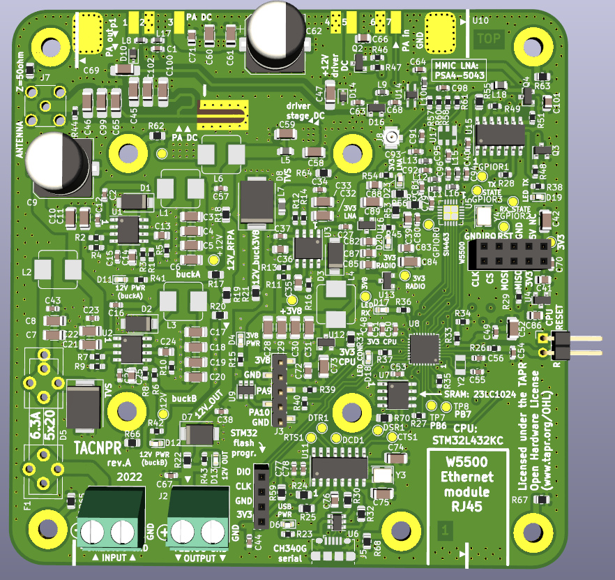

# TACNPR project 'Neppari'

NPR (New Packet Radio protocol) compatible Ethernet-connected radio w/ integrated RF PA.

Designed by Lasse OH3HZB & Tatu OH2EAT & SCOMS team (special thanks to Mikko OH2FLO, Vili OH5GE and Tommi OH1GJV (TACBUCK design))

Requires a W5500 based Ethernet (SPI) module to work, see photo w5500-module-photo.JPG to find proper model.

Licensed under the TAPR Open Hardware License 
www.tapr.org/OHL
