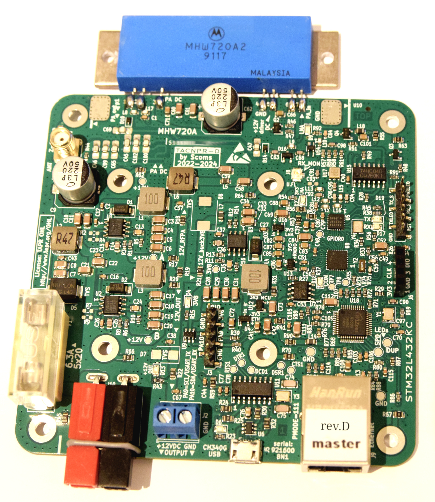

# TACNPR project ('Neppari')

NPR-compatible (New Packet Radio) Ethernet-connected radio w/ integrated RF PA for the 70cm HAM band.
TACNPR is binary-compatible with the original design /1/ by Guillaume F4HDK.

Designed by Lasse OH3HZB & Tatu OH2EAT & Scoms team (special thanks to Mikko OH2FLO, Vili OH5GE and Tommi OH1GJV (TACBUCK design))

Licensed under the TAPR Open Hardware License www.tapr.org/OHL

Please note that you need to be licensed HAM radio operator to use this radio. Remember to check your local regulations.

### Modifications for revA and revB to optimize RF performance

(these modifications are included in revC)

* C65 and C102: replace by 6p8
* C100: replace by 8p2

The tuning stub in revA/revB should be shorted according to the revC/revD layout.

### Project milestones and current status

* RevA: First version with Ethernet add-on module.
* RevB: Integrated Ethernet.
* RevC: RF performance enhancements (see the previous chapter). 
* RevD: Powerpole connector option added.

RevC and RevD are tested and fully functional. RevA & RevB require tuning (stub) and modifications mentioned above.

### Recommended TX power setting for maximum power with this PA module

set RF_power 55

/1/: NPR by Guillaume F4HDK (2018-): https://hackaday.io/project/164092-npr-new-packet-radio 

### Disclaimer

This design and all related material is provided as-is and is to be used at your own risk. The authors take no responsibility for any direct, indirect, incidental, or consequential 
damage that may arise from its use, including but not limited to damage to property, loss of data, or personal injury. Users are solely responsible for 
ensuring safe operation and adherence to all relevant laws and regulations. 

For the license terms, please refer to LICENSE file or http://www.tapr.org/OHL

