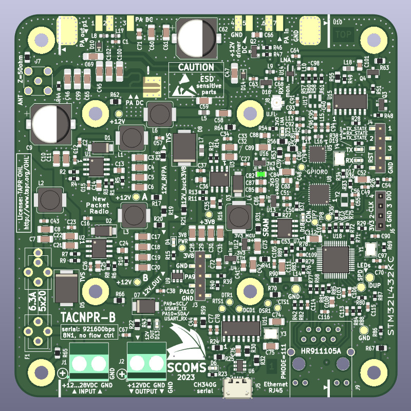
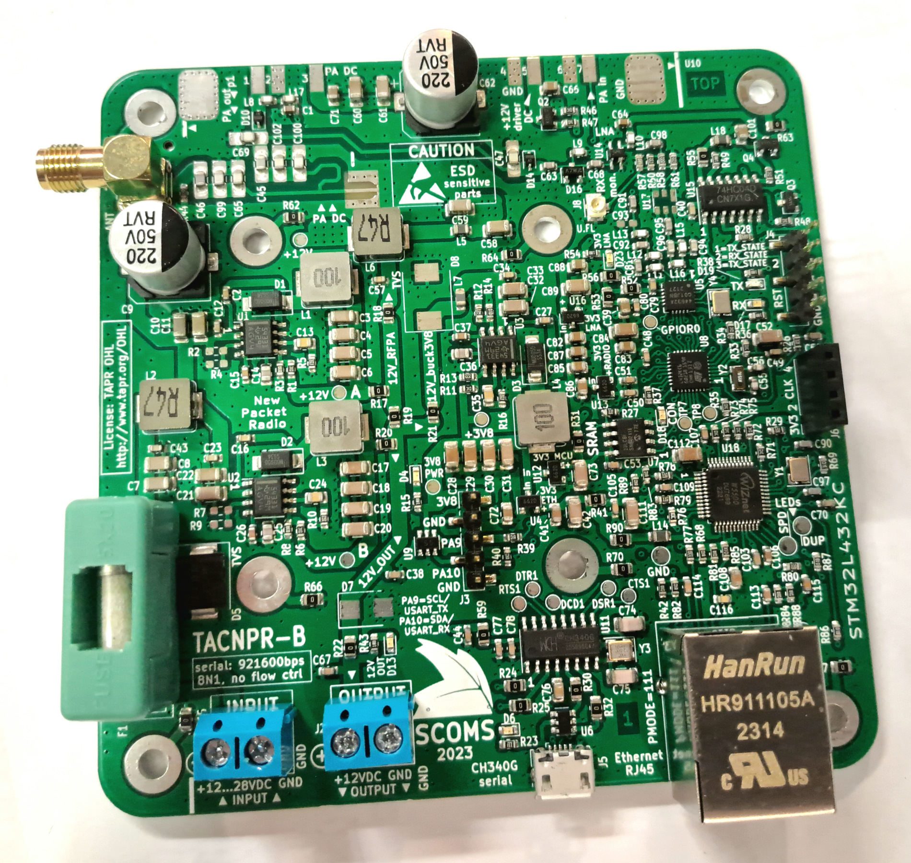

# TACNPR project 'Neppari'

NPR (New Packet Radio protocol) compatible Ethernet-connected radio w/ integrated RF PA. Revision B with integrated Ethernet.
TACNPR is binary-compatible with the original design /1/ by Guillaume F4HDK.

Designed by Lasse OH3HZB & Tatu OH2EAT & Scoms team (special thanks to Mikko OH2FLO, Vili OH5GE and Tommi OH1GJV (TACBUCK design))

Licensed under the TAPR Open Hardware License 
www.tapr.org/OHL

Please note that you need to be licensed HAM radio operator to use this radio.

/1/: NPR by Guillaume F4HDK (2018-): https://hackaday.io/project/164092-npr-new-packet-radio 
